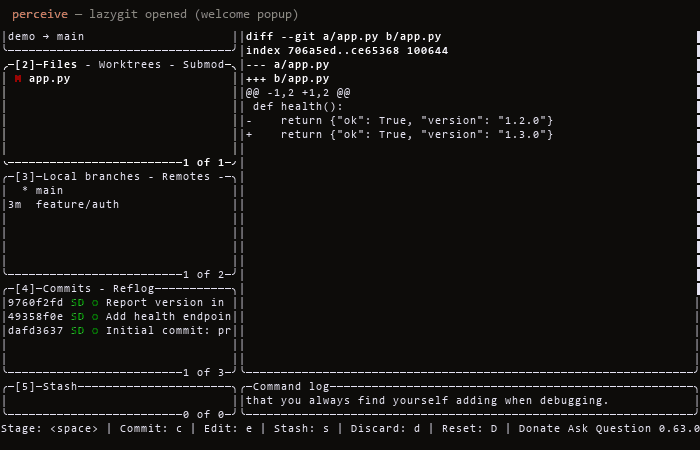
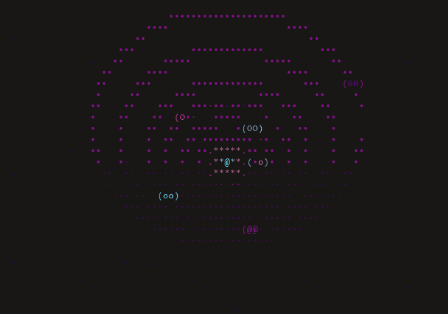
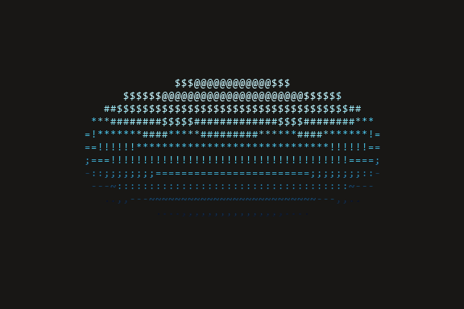
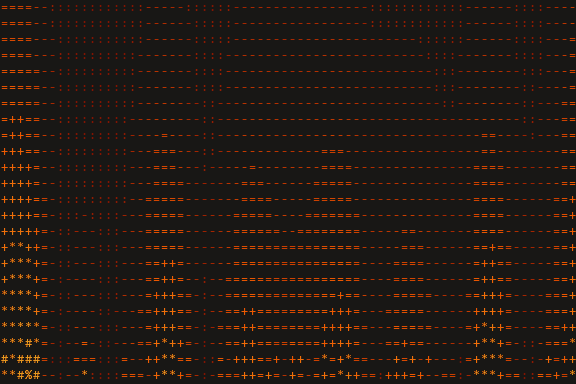
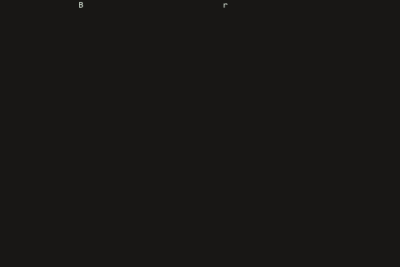

<!-- Language: English | [简体中文](docs/i18n/README.zh-Hans.md) | [繁體中文](docs/i18n/README.zh-Hant.md) | [日本語](docs/i18n/README.ja.md) | [한국어](docs/i18n/README.ko.md) -->
<!-- mcp-name: io.github.dwgx/smartcli -->
<!-- ^ MCP Registry PyPI ownership marker: this string must appear in the
     published package's README (= PyPI description) and match server.json's
     "name". Do not remove or change without updating server.json. -->

# SmartCLI

*Read this in: **English** · [简体中文](docs/i18n/README.zh-Hans.md) · [繁體中文](docs/i18n/README.zh-Hant.md) · [日本語](docs/i18n/README.ja.md) · [한국어](docs/i18n/README.ko.md)*

**A local Python toolkit for driving, perceiving, and rendering the terminal — three agent skills over one pluggable PTY + `pyte` core.**

[](https://pypi.org/project/smartcli-toolkit/)
[](https://pypi.org/project/smartcli-toolkit/)
[](https://github.com/dwgx/SmartCLI/actions/workflows/ci.yml)
[](https://codecov.io/gh/dwgx/SmartCLI)
[](LICENSE)
[](https://pypi.org/project/smartcli-toolkit/)
[](#features)
[](#install)

**Let an AI drive, perceive, and render real terminal programs.** SmartCLI reads
the actual screen with a `pyte` cell model — not a byte pipe — so it knows which
menu row is highlighted, presses the right keys, and waits for the screen to
settle. Below: it drives the real **lazygit** TUI end-to-end (arrow-key
navigation, opening a commit diff, highlighting a branch) — no script, no mock.

<p align="center">
  
</p>

```bash
pip install smartcli-toolkit
```

## What & why

SmartCLI is a workspace for terminal work that agents and humans both do: **driving**
interactive terminal programs, **perceiving** what a screen actually shows, and
**rendering** visuals and layouts back out. It is built on one shared, pluggable PTY
backend plus a `pyte` screen model — chosen over screenshot/vision so a single
structured screen model feeds both perception (read the screen) and rendering
(draw the screen). The PTY layer is intentionally **not** tmux-bound: local dev runs
on Windows via ConPTY (`pywinpty`), while target programs can run under POSIX ptys
or tmux elsewhere. Three skills sit on that core, each a self-contained tool you run
in place from the checkout.

## Driving a real TUI

The demo above is SmartCLI driving **lazygit** — a real full-screen curses app —
through its perceive → act → confirm loop: it reads the `pyte` cell grid (which
row is selected, the alt-screen diff), moves with arrow keys, opens a commit's
diff, and highlights a branch. Captured by driving the actual program in a Linux
container, not scripted or mocked. A byte-stream matcher like pexpect can't
perceive "which row is highlighted"; a screen model can.

> Honest scope: CI runs a Windows + Linux + macOS matrix. The POSIX pty backend
> (spawn / read / drive / resize / zombie-free terminate) is verified on Linux
> **and macOS** in CI; the interactive DECCKM/SS3-arrow probe is skipped on CI
> runners (no controllable terminal) and still wants a real-host run. Real tmux is
> not yet verified — known edges are listed in
> [`skills/drive-tui/references/LIMITATIONS.md`](skills/drive-tui/references/LIMITATIONS.md).

Verified on Windows 11, Python 3.14.6, `pyte` + `pywinpty` / ConPTY. This machine has
no real `tmux`, so screenshot reports are honestly labelled `pyte-simulation`, not
real tmux captures.

## Live effects

Real captures of the `cmd-art` `fx` engine — each GIF is the actual effect
rendered frame-by-frame through the project's own pipeline (no screen recorder).
Reproduce any with `python -m fx play <name>` (see [Quickstart](#quickstart)).

<p align="center">
  <br>
  <sub><b>solarsystem</b> — an orrery: planets on elliptical orbits around a pulsing sun</sub>
</p>

| | | |
|:---:|:---:|:---:|
|  |  |  |
| **donut** — the classic ASCII torus | **fire** — demoscene heat field | **rain** — Matrix digital rain |

> 🌐 **[Explore the live showcase →](https://dwgx.github.io/SmartCLI/)** — play with
> the effect engine, drive a menu with arrow keys, and poke the widgets, right in
> your browser.

## Install

**Primary — from PyPI:**

```bash
pip install smartcli-toolkit
```

> **Distribution vs import name:** the PyPI distribution is `smartcli-toolkit`
> (the names `smartcli` / `smart-cli` were taken or blocked), but the importable
> package is `smartcli_core`. So after `pip install smartcli-toolkit` you still
> write `from smartcli_core import PtySession`.

**Alternative — reproduce the full dev environment from a source checkout:**

```bash
git clone https://github.com/dwgx/SmartCLI SmartCLI
cd SmartCLI
python -m pip install -r requirements.txt
```

`requirements.txt` pulls only the two required runtime deps: `pyte` (everywhere) and
`pywinpty` (Windows only — the marker skips it on POSIX, which uses the stdlib `pty`
backend). From the checkout, `pip install .` installs the same importable
`smartcli_core` package.

Honest scope note: `pip install smartcli-toolkit` installs the clean, importable `smartcli_core`
package plus its required deps. It does **not** relocate the three skills — those run
in place via their own entry points (`python -m fx`, `python -m ui`,
`skills/drive-tui/scripts/tui.py`), exactly as the Quickstart shows. This is by design;
see the note at the top of [`pyproject.toml`](pyproject.toml).

**Optional extras** (real FIGlet fonts, raster images, authoritative cell widths — all
degrade gracefully to stdlib fallbacks when absent):

```bash
python -m pip install -r requirements-optional.txt
# or, from the checkout, via pyproject extras:
pip install ".[all]"        # pyfiglet + Pillow + wcwidth
pip install ".[art]"        # pyfiglet only
pip install ".[image]"      # Pillow only  (also: the PNG screenshot harness needs it)
pip install ".[width]"      # wcwidth only
```

**Windows note:** set UTF-8 output before running any skill so box-drawing and CJK
glyphs encode cleanly (the CLIs also auto-reconfigure stdout, but set this to be safe):

```powershell
set PYTHONIOENCODING=utf-8
```

Verified dep versions on the dev box (Windows 11, CPython 3.14.6): `pyte` 0.8.2,
`pywinpty` 3.0.5, `pyfiglet` 1.0.4, `Pillow` 12.2.0, `wcwidth` 0.8.1.

**Diagnostics.** `python -m smartcli_core` prints your OS, Python, terminal, PTY
backend, and dependency versions — run it and paste the output when filing a bug
(SmartCLI's behavior is very terminal- and platform-sensitive).

## Quickstart

### cmd-art — terminal visual effects

```bash
cd skills/cmd-art
python -m fx list                          # list all 28 effects
python -m fx play donut --seconds 5        # play one effect (bounded)
python -m fx gallery                       # one frame of each effect
python -m fx show --seq "donut:fire:3,plasma::3"
```

### tui-ui — cell-accurate terminal UI

```bash
cd skills/tui-ui
python -m ui widgets                       # list all 15 widgets
python -m ui gallery --width 100 --height 30
python -m ui demo table --width 80 --height 12 --theme dashboard
```

### drive-tui — perceive & drive interactive programs

Persistent-session CLI (state survives across shell calls):

```bash
python skills/drive-tui/scripts/tui.py start --cmd "python" --cols 80 --rows 24
python skills/drive-tui/scripts/tui.py wait-regex --id <SID> ">>> " --timeout-ms 15000
python skills/drive-tui/scripts/tui.py send-line --id <SID> "print(6*7)"
python skills/drive-tui/scripts/tui.py snapshot --id <SID>
python skills/drive-tui/scripts/tui.py close --id <SID>
```

Or drive from any MCP client — the same verbs as MCP tools, with the
per-session token attached automatically:

```bash
pip install "smartcli-toolkit[mcp]"
python skills/drive-tui/scripts/mcp_server.py     # stdio MCP server
```

### As a library

The shared core is importable directly:

```python
import sys
from smartcli_core import PtySession

s = PtySession()
s.start([sys.executable, "-q"])
s.wait_for(r">>> ")            # readiness sync, never a blind sleep
print(s.snapshot().to_text())  # pyte-backed structured screen
s.close()
```

For the full command reference, the screenshot/AGENTCLI harnesses, and the regression
suite, see **[`README-USAGE.md`](README-USAGE.md)**.

## Features

**`cmd-art`** (`skills/cmd-art`) — a "living-template" effect engine: an `Effect` ABC +
`@register` decorator + auto-discovery. **28 effects** (donut, solarsystem, fire, plasma,
rain, starfield, tunnel, text3d, cube, sphere, boids, life, fireworks, sparkle, decrypt,
gradient_text, banner_scroll, image2ascii, typewriter, julia, mandelbrot, perlin, flames, water, nebula, text_flyin, text_converge, text_decrypt) across **8 themes** (mono, fire,
ocean, synthwave, viridis, pastel, matrix-green, rainbow). Effects are pure frame
producers; `play` is bounded by default and always restores the terminal.

**`tui-ui`** (`skills/tui-ui`) — a web-like terminal layout engine emitting tmux-safe
ANSI frames (SGR color runs + newlines only; no cursor moves, no alt-screen). **15
widgets** (badge, banner, braille_chart, card, gradient_rule, kv, meter, panel,
progress, radial_glow, rule, slider_track, table, tabs, tree) over a real **engine**:
`field.py` (shader compositors), `raster.py` (sub-cell half/quad/braille pixels),
`box_junction.py` (edge-algebra box joins), `color_model.py` (honest truecolor → 256 →
16 → mono degrade). Display-cell accurate for CJK/emoji/ZWJ so columns never desync.

**`drive-tui`** (`skills/drive-tui`) — drives interactive terminal programs (REPLs,
menus, pagers, y/N prompts, wizards) through a PTY via a
perceive → decide → act → wait → confirm loop, never a blind sleep. A thin CLI
(`scripts/tui.py`) offers a persistent detached session and a one-shot `run` mode, with
an importable pattern library of **8 recipes** (repl, menu_select, pager, search_filter,
confirm, form, progress, wizard) that `classify()` a screen and `drive()` it.

**Shared core** (`smartcli_core`) — the pluggable PTY backend + `pyte` screen model +
semantic snapshot + readiness sync (`pty_backend / screen_model / snapshot / readiness /
session`). The reusable, importable foundation under all three skills.

**Knowledge graph** (`knowledge/`) — a 122-note wiki-link graph of exact rendering
formulas, ANSI sequences, and measured constants, each note carrying a source and
cross-links. See [`knowledge/INDEX.md`](knowledge/INDEX.md).

## Project layout

```text
SmartCLI/
  smartcli_core/           shared PTY + pyte engine (importable package)
  skills/cmd-art/          fx effect package and CLI (28 effects, 8 themes)
  skills/drive-tui/        TUI pattern library and PTY driver CLI (8 recipes)
  skills/tui-ui/           terminal UI layout engine and widgets (15 widgets)
  tools/screenshot/        pyte -> PNG smoke-test harness
  tools/agentcli/          agent-CLI control validation harness
  knowledge/               122-note knowledge graph (see knowledge/INDEX.md)
  showcase/                rendered effect PNGs + demo GIFs (shown above)
  tests/                   direct script-style regressions
  research/                archived first-pass research notes
```

## Documentation

- **[`README-USAGE.md`](README-USAGE.md)** — the full usage cheat-sheet: every skill,
  the screenshot and AGENTCLI harnesses, and the regression commands.
- **[`knowledge/INDEX.md`](knowledge/INDEX.md)** — the 122-note knowledge graph.
- **[`AGENTCLI-VALIDATION.md`](AGENTCLI-VALIDATION.md)** — agent-CLI control test matrix.
- **[`CHANGELOG.md`](CHANGELOG.md)** — release history.

## License

MIT — see [LICENSE](LICENSE).
