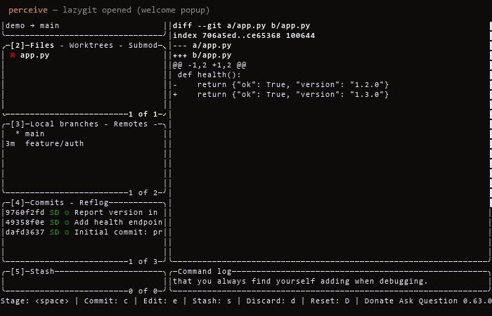
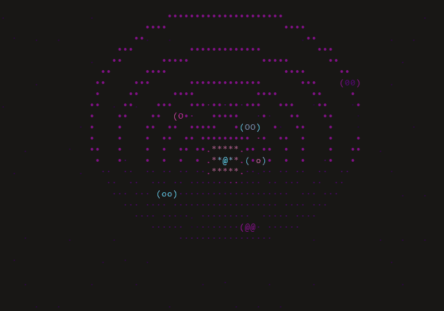
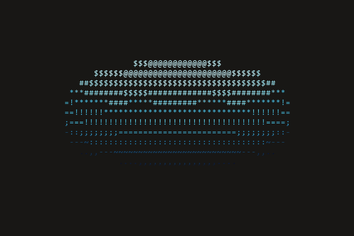
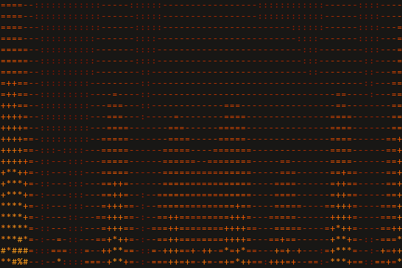
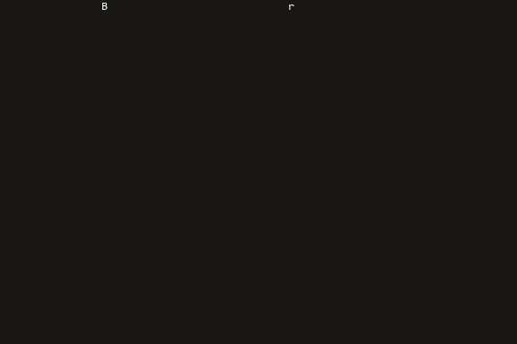

<!-- Language: [English](../../README.md) | [简体中文](README.zh-Hans.md) | [繁體中文](README.zh-Hant.md) | 日本語 | [한국어](README.ko.md) -->

# SmartCLI

*この文書の言語: [English](../../README.md) · [简体中文](README.zh-Hans.md) · [繁體中文](README.zh-Hant.md) · **日本語** · [한국어](README.ko.md)*

**ターミナルを駆動・認識・描画するためのローカル Python ツールキット。1 つの差し替え可能な PTY + `pyte` コアの上に、3 つのエージェントスキルを構築しています。**

[](https://pypi.org/project/smartcli-toolkit/)
[](https://pypi.org/project/smartcli-toolkit/)
[](https://github.com/dwgx/SmartCLI/actions/workflows/ci.yml)
[](../../LICENSE)
[](https://pypi.org/project/smartcli-toolkit/)
[](#features)
[](#install)

## 何を・なぜ

SmartCLI は、エージェントと人間の双方が行うターミナル作業のためのワークスペースです。対話型のターミナルプログラムを**駆動**し、画面に実際に表示されている内容を**認識**し、ビジュアルやレイアウトを**描画**して返します。共有された差し替え可能な 1 つの PTY バックエンドと `pyte` のスクリーンモデルの上に構築されています。スクリーンショットやビジョンではなくこの方式を選んだのは、構造化された単一のスクリーンモデルが、認識（画面を読む）と描画（画面を描く）の両方を同時に支えられるからです。PTY レイヤーは意図的に tmux に**縛られていません**。ローカル開発は Windows 上で ConPTY（`pywinpty`）を介して動作し、対象プログラムは別環境の POSIX pty や tmux 上で動かすこともできます。このコアの上に 3 つのスキルが載っており、いずれもチェックアウトからその場で実行できる自己完結型のツールです。

ローカル開発は Windows 11、Python 3.14.6、`pyte` + `pywinpty` / ConPTY 上で行っており、CI は Windows + Linux + macOS のマトリクスで検証しています。ただし本物の `tmux` はまだ検証できていないため、スクリーンショットのレポートは実際の tmux キャプチャではなく、正直に `pyte-simulation` とラベル付けされています。

## Driving a real TUI

SmartCLI が **lazygit**（本物のフルスクリーン curses アプリ）を、認識 → 実行 → 確認
のループで駆動している様子です。`pyte` のセルグリッドを読み取り、矢印キーで移動し、
コミットの diff を開き、ブランチをハイライトします。スクリプト化された録画ではなく、
Linux コンテナ内で実際のプログラムを駆動してキャプチャしたものです。pexpect のような
バイトストリームのマッチャでは「どの行がハイライトされているか」を認識できません。
スクリーンモデルならそれができます。

<p align="center">
  
</p>

> 率直なスコープ: CI は Windows + Linux + macOS のマトリクスで実行します。POSIX pty
> バックエンド（spawn / read / drive / resize / ゾンビフリーな終了）は CI 上で Linux と
> macOS の両方で検証済みですが、対話的な DECCKM/SS3 矢印キープローブは CI ランナーでは
> スキップされており、依然として実機での実行が必要です。本物の tmux はまだ未検証です —
> [`skills/drive-tui/references/LIMITATIONS.md`](../../skills/drive-tui/references/LIMITATIONS.md)
> を参照してください。

## ライブエフェクト

`cmd-art` の `fx` エンジンの実キャプチャです — 各 GIF は、プロジェクト自身の
パイプラインでフレームごとにレンダリングした実際のエフェクトです（スクリーン
レコーダーは不使用）。いずれも `python -m fx play <name>` で再現できます
（[クイックスタート](#quickstart)を参照）。

<p align="center">
  <br>
  <sub><b>solarsystem</b> — オーラリー: 脈動する太陽の周りを楕円軌道で回る惑星たち</sub>
</p>

| | | |
|:---:|:---:|:---:|
|  |  |  |
| **donut** — 古典の ASCII トーラス | **fire** — デモシーンの熱場 | **rain** — Matrix のデジタルレイン |

> 🌐 **[ライブショーケースを探索する →](https://dwgx.github.io/SmartCLI/index.ja.html)** —
> エフェクトエンジンで遊び、矢印キーでメニューを駆動し、ウィジェットを触ってみる。
> すべてブラウザの中で動きます。

## Install

**推奨 — PyPI から:**

```bash
pip install smartcli-toolkit
```

Python 3.10 以降が必要です。共有ライブラリ、永続 TUI ドライバー、stdio MCP サーバーがインストールされます。

> **配布名とインポート名の違い:** PyPI での配布名は `smartcli-toolkit` です
> （`smartcli` / `smart-cli` という名前はすでに取得済み、あるいはブロックされていました）が、
> インポート可能なパッケージ名は `smartcli_core` です。したがって `pip install smartcli-toolkit`
> の後も、コードでは `from smartcli_core import PtySession` と書きます。

**代替 — ソースのチェックアウトから完全な開発環境を再現する:**

```bash
git clone https://github.com/dwgx/SmartCLI SmartCLI
cd SmartCLI
python -m pip install -r requirements.txt
```

`requirements.txt` は `pyte`、MCP SDK、Windows 専用の `pywinpty` をインストールします
（POSIX は標準ライブラリの `pty` を使用します）。`pip install .` は `smartcli_core` と
`smartcli-tui`、`smartcli-mcp`、`smartcli-toolkit` の各コマンドをインストールします。
ビジュアル用の `cmd-art` と `tui-ui` スキルは、チェックアウトから `python -m fx` と
`python -m ui` で引き続き実行します。

**オプションの追加パッケージ**（本物の FIGlet フォント、ラスター画像、正確なセル幅 — いずれも
存在しない場合は標準ライブラリのフォールバックへ穏やかにデグレードします）:

```bash
python -m pip install -r requirements-optional.txt
# or, from the checkout, via pyproject extras:
pip install ".[all]"        # pyfiglet + Pillow + wcwidth
pip install ".[art]"        # pyfiglet only
pip install ".[image]"      # Pillow only  (also: the PNG screenshot harness needs it)
pip install ".[width]"      # wcwidth only
```

**Windows での注意:** 罫線素片や CJK グリフを正しくエンコードできるよう、スキルを実行する前に
UTF-8 出力を設定してください（各 CLI は stdout を自動で再構成もしますが、念のため設定しておきます）:

```powershell
set PYTHONIOENCODING=utf-8
```

開発機（Windows 11、CPython 3.14.6）で検証済みの依存バージョン: `pyte` 0.8.2、
`pywinpty` 3.0.5、`pyfiglet` 1.0.4、`Pillow` 12.2.0、`wcwidth` 0.8.1。

**診断。** `python -m smartcli_core` は OS、Python、ターミナル、PTY バックエンド、
依存パッケージのバージョンを表示します。`smartcli-tui doctor` は、コアがどこから
ロードされたか、drive 系の依存がそろっているかを報告します。ターミナルに依存する
バグを報告するときは、両方の出力を添えてください。

## Quickstart

### cmd-art — ターミナルのビジュアルエフェクト

```bash
cd skills/cmd-art
python -m fx list                          # list all 30 effects
python -m fx play donut --seconds 5        # play one effect (bounded)
python -m fx gallery                       # one frame of each effect
python -m fx show --seq "donut:fire:3,plasma::3"
```

### tui-ui — セル単位で正確なターミナル UI

```bash
cd skills/tui-ui
python -m ui widgets                       # list all 17 widgets
python -m ui gallery --width 100 --height 30
python -m ui demo table --width 80 --height 12 --theme dashboard
```

### drive-tui — 対話型プログラムを認識・駆動する

永続セッション CLI（状態はシェル呼び出しをまたいで保持されます）:

```bash
smartcli-tui start --cmd "python3 -i -q" --cols 80 --rows 24
smartcli-tui wait-regex --id <SID> ">>> " --timeout-ms 15000
smartcli-tui send-line --id <SID> "print(6*7)"
smartcli-tui snapshot --id <SID>
smartcli-tui close --id <SID>
```

Windows では子コマンドを `py -i -q` に置き換えてください。ソースから実行する場合は、
`smartcli-tui` を `python skills/drive-tui/scripts/tui.py` に置き換えます。

あるいは、任意の MCP クライアントから駆動することもできます — 同じ動詞が MCP
ツールとして公開され、セッションごとのトークンは自動で付与されます:

```bash
pip install smartcli-toolkit
smartcli-mcp     # stdio MCP server; smartcli-toolkit is an equivalent alias
```

### ライブラリとして

共有コアは直接インポートできます:

```python
import sys
from smartcli_core import PtySession

s = PtySession()
s.start([sys.executable, "-q"])
s.wait_for(r">>> ")            # readiness sync, never a blind sleep
print(s.snapshot().to_text())  # pyte-backed structured screen
s.close()
```

コマンドリファレンスの全体、スクリーンショット / AGENTCLI ハーネス、リグレッションスイートについては、
**[`README-USAGE.md`](../../README-USAGE.md)** を参照してください。

## Features

**`cmd-art`**（`skills/cmd-art`）— 「リビングテンプレート」型のエフェクトエンジン。`Effect` ABC +
`@register` デコレータ + 自動検出で構成されます。**30 種のエフェクト**（donut、solarsystem、fire、plasma、rain、
starfield、tunnel、text3d、cube、sphere、boids、life、fireworks、sparkle、decrypt、
gradient_text、banner_scroll、image2ascii、typewriter、julia、mandelbrot、perlin、flames、water、nebula、text_flyin、text_converge、text_decrypt、spectrum_bars、cbonsai）を **8 種のテーマ**（mono、fire、
ocean、synthwave、viridis、pastel、matrix-green、rainbow）にわたって備えます。エフェクトは純粋な
フレームプロデューサであり、`play` はデフォルトで時間制限付きで、常にターミナルを元の状態へ復元します。

**`tui-ui`**（`skills/tui-ui`）— tmux セーフな ANSI フレーム（SGR カラーラン + 改行のみ。
カーソル移動なし、代替スクリーンなし）を出力する、Web ライクなターミナルレイアウトエンジン。**17 種の
ウィジェット**（badge、banner、braille_chart、card、fuzzy_filter_list、gradient_rule、kv、meter、panel、
preview_pane、progress、radial_glow、rule、slider_track、table、tabs、tree）を、本物の**エンジン**の上に載せています。
`field.py`（シェーダコンポジタ）、`raster.py`（サブセルの half/quad/braille ピクセル）、
`box_junction.py`（辺の代数による罫線結合）、`color_model.py`（トゥルーカラー → 256 → 16 → mono
への正直なデグレード）。CJK / 絵文字 / ZWJ に対して表示セル単位で正確なので、列がずれることはありません。

**`drive-tui`**（`skills/drive-tui`）— 対話型のターミナルプログラム（REPL、メニュー、ページャ、
y/N プロンプト、ウィザード）を PTY 経由で駆動します。ブラインドスリープではなく、
認識 → 判断 → 操作 → 待機 → 確認 のループを通じて動作します。薄い CLI（`scripts/tui.py`）が、
永続的なデタッチセッションとワンショットの `run` モードを提供し、画面を `classify()`（分類）して
`drive()`（駆動）する **8 種のレシピ**（repl、menu_select、pager、search_filter、confirm、form、
progress、wizard）から成るインポート可能なパターンライブラリを備えます。

**共有コア**（`smartcli_core`）— 差し替え可能な PTY バックエンド + `pyte` スクリーンモデル +
セマンティックスナップショット + readiness 同期（`pty_backend / screen_model / snapshot / readiness /
session`）。3 つのスキルすべての土台となる、再利用可能でインポート可能な基盤です。

**ナレッジグラフ**（`knowledge/`）— 正確な描画式、ANSI シーケンス、実測した定数からなる
wiki リンクグラフ（140+ の `.md` ファイル）。各ノートは出典と相互リンクを持ちます。
[`knowledge/INDEX.md`](../../knowledge/INDEX.md) を参照してください。

## プロジェクト構成

```text
SmartCLI/
  smartcli_core/           shared PTY + pyte engine (importable package)
  skills/cmd-art/          fx effect package and CLI (30 effects, 8 themes)
  skills/drive-tui/        TUI pattern library and PTY driver CLI (8 recipes)
  skills/tui-ui/           terminal UI layout engine and widgets (17 widgets)
  tools/screenshot/        pyte -> PNG smoke-test harness
  tools/agentcli/          agent-CLI control validation harness
  knowledge/               wiki-link knowledge graph, 140+ .md files (see knowledge/INDEX.md)
  showcase/                rendered effect PNGs + demo GIFs (shown above)
  tests/                   direct script-style regressions
  research/                archived first-pass research notes
```

## ドキュメント

- **[`README-USAGE.md`](../../README-USAGE.md)** — 使い方の完全なチートシート。すべてのスキル、
  スクリーンショットと AGENTCLI のハーネス、リグレッションコマンドを網羅しています。
- **[`knowledge/INDEX.md`](../../knowledge/INDEX.md)** — ナレッジグラフ（140+ の `.md` ファイル）。
- **[`AGENTCLI-VALIDATION.md`](../../AGENTCLI-VALIDATION.md)** — agent-CLI 制御のテストマトリクス。
- **[`CHANGELOG.md`](../../CHANGELOG.md)** — リリース履歴。

## ライセンス

MIT — [LICENSE](../../LICENSE) を参照してください。
