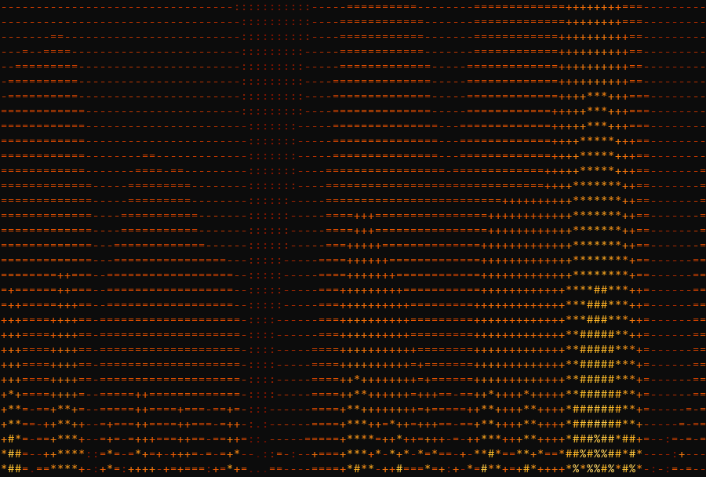
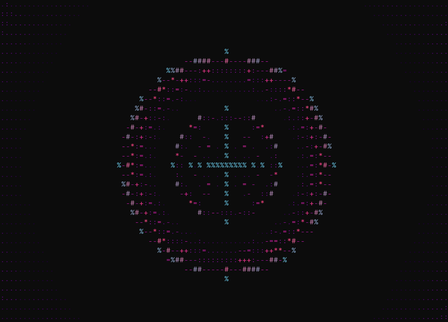

<!-- Language: [English](../../README.md) | 简体中文 | [繁體中文](README.zh-Hant.md) | [日本語](README.ja.md) | [한국어](README.ko.md) -->

# SmartCLI

*阅读其他语言版本：[English](../../README.md) · **简体中文** · [繁體中文](README.zh-Hant.md) · [日本語](README.ja.md) · [한국어](README.ko.md)*

**一个用于驱动、感知与渲染终端的本地 Python 工具箱 —— 在一套可插拔的 PTY + `pyte` 内核之上构建的三个 agent skill。**

[](https://pypi.org/project/smartcli-toolkit/)
[](https://pypi.org/project/smartcli-toolkit/)
[](https://github.com/dwgx/SmartCLI/actions/workflows/ci.yml)
[](../../LICENSE)
[](https://pypi.org/project/smartcli-toolkit/)
[](#功能特性)
[](#安装)

## 是什么，为什么

SmartCLI 是一个面向终端工作的工作区，agent 和人类都会用到它：**驱动**交互式终端程序、**感知**屏幕上真正显示的内容，以及将视觉效果与布局**渲染**输出。它构建在一套共享、可插拔的 PTY 后端加上 `pyte` 屏幕模型之上 —— 之所以选择这种方案而非截图/视觉方案，是为了让同一个结构化的屏幕模型同时服务于感知（读取屏幕）和渲染（绘制屏幕）。PTY 层刻意**不**与 tmux 绑定：本地开发在 Windows 上通过 ConPTY（`pywinpty`）运行，而目标程序可以在别处的 POSIX pty 或 tmux 下运行。三个 skill 都坐落在这套内核之上，每一个都是自成一体的工具，直接在代码检出目录中就地运行。

CI 跑 Windows + Linux + macOS 三平台矩阵，POSIX pty 后端（spawn/read/drive/resize/无僵尸进程 terminate）已在 CI 的 Linux 和 macOS 上验证。本地开发在 Windows 11、Python 3.14.6、`pyte` + `pywinpty` / ConPTY 上运行。这台机器没有真正的 `tmux`，因此截图报告如实标注为 `pyte-simulation`，而非真实的 tmux 抓取。

## 驱动真实 TUI

SmartCLI 通过它的感知 → 行动 → 确认循环驱动 **lazygit** —— 一个真正的全屏 curses 应用：它读取 `pyte` 单元格网格（哪一行被选中、alt-screen 的差异），用方向键移动光标，打开某次提交的 diff，并高亮一个分支。这是在 Linux 容器里驱动真实程序抓取的，并非脚本或 mock。像 pexpect 这样的字节流匹配器无法感知“哪一行被高亮”；而一个屏幕模型可以。

<p align="center">
  
</p>

> 诚实范围:CI 跑 Windows + Linux + macOS 三平台矩阵。POSIX pty 后端(spawn/read/
> drive/resize/无僵尸进程 terminate)已在 CI 的 Linux **和 macOS** 上验证;交互式
> DECCKM/SS3 方向键探针在 CI runner 上跳过(无可控终端),仍需真机运行一次。真实
> tmux 尚未验证 —— 已知边界见
> [`skills/drive-tui/references/LIMITATIONS.md`](../../skills/drive-tui/references/LIMITATIONS.md)。

## 截图

一小组通过 `fx` 引擎渲染的 `cmd-art` 效果集锦。你可以用 `python -m fx play <name>` 复现其中任意一个（参见[快速上手](#快速上手)）。

| | | |
|:---:|:---:|:---:|
|  |  |  |
| **donut** | **fire** | **plasma** |
|  |  |  |
| **rain** | **starfield** | **tunnel** |

## 安装

**首选 —— 从 PyPI 安装：**

```bash
pip install smartcli-toolkit
```

> **分发名与导入名：** PyPI 上的分发包名是 `smartcli-toolkit`
> （`smartcli` / `smart-cli` 这些名字已被占用或被屏蔽），但可导入的
> 包名是 `smartcli_core`。所以在 `pip install smartcli-toolkit` 之后，你依然要
> 写 `from smartcli_core import PtySession`。

**备选 —— 从源码检出复现完整的开发环境：**

```bash
git clone https://github.com/dwgx/SmartCLI SmartCLI
cd SmartCLI
python -m pip install -r requirements.txt
```

`requirements.txt` 只拉取两个必需的运行时依赖：`pyte`（所有平台）和
`pywinpty`（仅 Windows —— 环境标记会在 POSIX 上跳过它，POSIX 使用标准库的 `pty`
后端）。在检出目录中，`pip install .` 会安装同一个可导入的
`smartcli_core` 包。

关于安装范围的坦诚说明：`pip install smartcli-toolkit` 安装的是干净、可导入的 `smartcli_core`
包及其必需依赖。它**不会**搬移那三个 skill —— 它们通过各自的入口点就地运行
（`python -m fx`、`python -m ui`、
`skills/drive-tui/scripts/tui.py`），正如快速上手中所示。这是有意为之的设计；
参见 [`pyproject.toml`](../../pyproject.toml) 顶部的说明。

**可选附加项**（真正的 FIGlet 字体、位图图像、权威的单元格宽度 ——
缺失时都会优雅降级到标准库的回退方案）：

```bash
python -m pip install -r requirements-optional.txt
# or, from the checkout, via pyproject extras:
pip install ".[all]"        # pyfiglet + Pillow + wcwidth
pip install ".[art]"        # pyfiglet only
pip install ".[image]"      # Pillow only  (also: the PNG screenshot harness needs it)
pip install ".[width]"      # wcwidth only
```

**Windows 提示：** 在运行任何 skill 之前先设置 UTF-8 输出，这样框线字符和 CJK
字形才能正确编码（这些 CLI 也会自动重新配置 stdout，但为保险起见还是设置一下）：

```powershell
set PYTHONIOENCODING=utf-8
```

在开发机上验证过的依赖版本（Windows 11，CPython 3.14.6）：`pyte` 0.8.2、
`pywinpty` 3.0.5、`pyfiglet` 1.0.4、`Pillow` 12.2.0、`wcwidth` 0.8.1。

## 快速上手

### cmd-art —— 终端视觉效果

```bash
cd skills/cmd-art
python -m fx list                          # list all 28 effects
python -m fx play donut --seconds 5        # play one effect (bounded)
python -m fx gallery                       # one frame of each effect
python -m fx show --seq "donut:fire:3,plasma::3"
```

### tui-ui —— 单元格精确的终端 UI

```bash
cd skills/tui-ui
python -m ui widgets                       # list all 17 widgets
python -m ui gallery --width 100 --height 30
python -m ui demo table --width 80 --height 12 --theme dashboard
```

### drive-tui —— 感知并驱动交互式程序

持久会话 CLI（状态可在多次 shell 调用之间保留）：

```bash
python skills/drive-tui/scripts/tui.py start --cmd "python" --cols 80 --rows 24
python skills/drive-tui/scripts/tui.py wait-regex --id <SID> ">>> " --timeout-ms 15000
python skills/drive-tui/scripts/tui.py send-line --id <SID> "print(6*7)"
python skills/drive-tui/scripts/tui.py snapshot --id <SID>
python skills/drive-tui/scripts/tui.py close --id <SID>
```

### 作为库使用

共享内核可以直接导入：

```python
import sys
from smartcli_core import PtySession

s = PtySession()
s.start([sys.executable, "-q"])
s.wait_for(r">>> ")            # readiness sync, never a blind sleep
print(s.snapshot().to_text())  # pyte-backed structured screen
s.close()
```

完整的命令参考、截图/AGENTCLI 测试框架以及回归测试套件，请参见
**[`README-USAGE.md`](../../README-USAGE.md)**。

## 功能特性

**`cmd-art`**（`skills/cmd-art`）—— 一个“活模板”式的效果引擎：`Effect` 抽象基类 +
`@register` 装饰器 + 自动发现。**28 种效果**（donut、solarsystem、fire、plasma、rain、
starfield、tunnel、text3d、cube、sphere、boids、life、fireworks、sparkle、decrypt、
gradient_text、banner_scroll、image2ascii、typewriter、julia、mandelbrot、perlin、flames、water、nebula、text_flyin、text_converge、text_decrypt）横跨 **8 种主题**（mono、fire、
ocean、synthwave、viridis、pastel、matrix-green、rainbow）。效果都是纯粹的帧生产者；
`play` 默认有时间上限，并且总会恢复终端状态。

**`tui-ui`**（`skills/tui-ui`）—— 一个类 Web 的终端布局引擎，输出 tmux 安全的
ANSI 帧（仅使用 SGR 颜色段 + 换行；不移动光标，不使用备用屏幕）。**17 个
组件**（badge、banner、braille_chart、card、gradient_rule、kv、meter、panel、
progress、radial_glow、rule、slider_track、table、tabs、tree），底层是一套真正的**引擎**：
`field.py`（着色器合成器）、`raster.py`（子单元格 half/quad/braille 像素）、
`box_junction.py`（边代数式的方框连接）、`color_model.py`（诚实的 truecolor → 256 →
16 → mono 降级）。对 CJK/emoji/ZWJ 做到显示单元格精确，列永不错位。

**`drive-tui`**（`skills/drive-tui`）—— 通过 PTY 驱动交互式终端程序（REPL、
菜单、分页器、y/N 提示、向导），采用
感知 → 决策 → 行动 → 等待 → 确认的循环，绝不盲目 sleep。一个轻量 CLI
（`scripts/tui.py`）提供持久的分离式会话和一次性的 `run` 模式，并配有
一个可导入的模式库，内含 **8 种配方**（repl、menu_select、pager、search_filter、
confirm、form、progress、wizard），它们会先对屏幕执行 `classify()`，再对其 `drive()`。

**共享内核**（`smartcli_core`）—— 可插拔的 PTY 后端 + `pyte` 屏幕模型 +
语义化快照 + 就绪同步（`pty_backend / screen_model / snapshot / readiness /
session`）。这是三个 skill 之下可复用、可导入的基础。

**知识图谱**（`knowledge/`）—— 一个由 122 篇笔记通过 wiki 链接构成的图谱，收录了
精确的渲染公式、ANSI 序列和实测常量，每篇笔记都附有来源和
交叉引用。参见 [`knowledge/INDEX.md`](../../knowledge/INDEX.md)。

## 项目结构

```text
SmartCLI/
  smartcli_core/           shared PTY + pyte engine (importable package)
  skills/cmd-art/          fx effect package and CLI (28 effects, 8 themes)
  skills/drive-tui/        TUI pattern library and PTY driver CLI (8 recipes)
  skills/tui-ui/           terminal UI layout engine and widgets (17 widgets)
  tools/screenshot/        pyte -> PNG smoke-test harness
  tools/agentcli/          agent-CLI control validation harness
  knowledge/               122-note knowledge graph (see knowledge/INDEX.md)
  showcase/                rendered effect PNGs (see Screenshots)
  tests/                   direct script-style regressions
  research/                archived first-pass research notes
```

## 文档

- **[`README-USAGE.md`](../../README-USAGE.md)** —— 完整的使用速查表：每个 skill、
  截图和 AGENTCLI 测试框架，以及回归测试命令。
- **[`knowledge/INDEX.md`](../../knowledge/INDEX.md)** —— 122 篇笔记的知识图谱。
- **[`AGENTCLI-VALIDATION.md`](../../AGENTCLI-VALIDATION.md)** —— agent-CLI 控制测试矩阵。
- **[`CHANGELOG.md`](../../CHANGELOG.md)** —— 发布历史。

## 许可证

MIT —— 参见 [LICENSE](../../LICENSE)。
